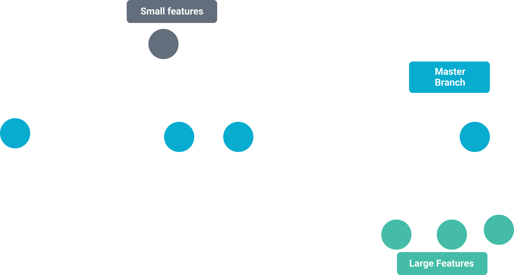
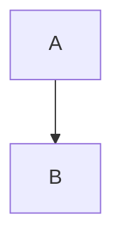
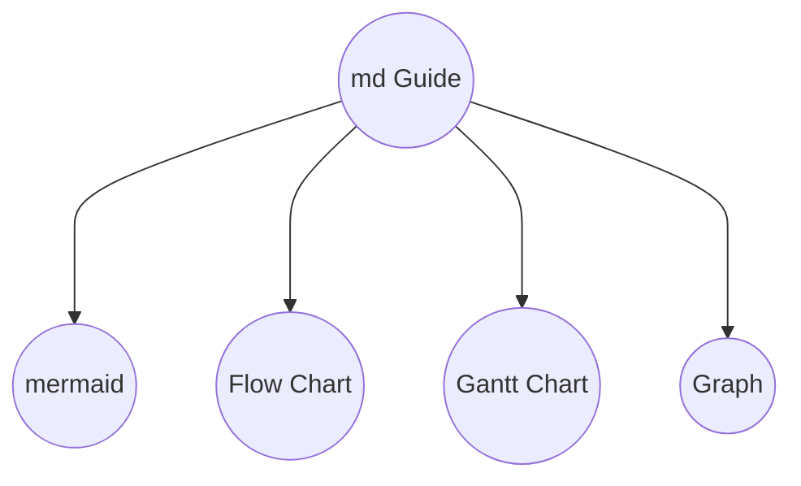
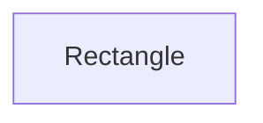
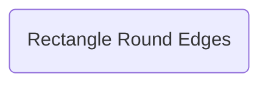
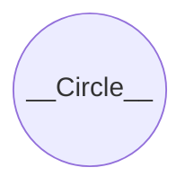
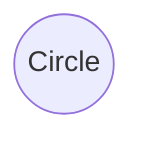
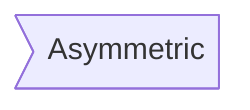
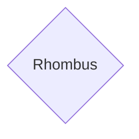

### Markdown Guide
## Table of Contents
|No| Content | link |No| Content | link |
|---| ---| ---|---| ---| ---|
|1.| Hedings| [click](#hedings) |7.| Quoting code| [click](#quoting-code)|
|2.| Styling text| [click](#styling-text)|8.| Link| [click](#link)|
|3.| List| [click](#list)|9.| Images| [click](#images)|
|4.| Table| [click](#table)|10.|Mermaid|[click](#mermaid)|
|5.| Highlight| [click](#highlight)|
|6.| Horizontal line| [click](#horizontal-line)|

---
### Hedings
`# A first-level heading`

`## A second-level heading`

`### A third-level heading`

>1. # A first-level heading
>1. ## A second-level heading
>1. ### A third-level heading
---
### Styling text
| style |Example| syntax |
|---| ---| ---|
|**Bold**|`**To Make Bold Use**`| `**`|
|*Italic*|`*To Make Italic Use*`| `*`|
|~~Strikethrough~~|`~~To make Strikethrough Use~~`| `~~` |
|**To make Nested Bold and *italic* Use**|`**To make Nested Bold and *italic* Use**` |`* **` |

---
### List
ordert list

`1. one`
`1. two`
`1. three`

1. one
1. two
1. three

unordert list

`- one`
`- two`
`- three`
- one
- two
- three

---
### Table
```
| syntex | description|
| ---| ---|
| title| description|
```
| syntex | description|
| ---| ---|
| title| description|

---
### Highlight
<pre>
> To highlight you can use Blockquotes >

`#RRGGBB`

``` 
    To highlight multiple things you can use
```
</pre>
> To highlight you can use

`#RRGGBB`

``` 
    To highlight multiple things you can use
```
---
### Horizontal line

You can use `---` 3 hyphen

---
### Quoting code

**JavaScript Program**
<pre>
    ```javascript
    console.log("hello");
    //this is js code
    ```
</pre>

```javascript
    console.log("hello");
    //this is js code
```
**C Program**
<pre>
    ```c
    #include<stdio.h>
    int main(){
        printf("Hello World!);
    return 0;
    }
   ```
</pre>

```c
    #include<stdio.h>
    int main(){
        printf("Hello World!);
    return 0;
    }
```

---
### Link

`[ref](link)`

`[Table of Content](#table-of-contents)`
`[YouTube](https://www.youtube.com/)`

[Table of Content](#table-of-contents)

[YouTube](https://www.youtube.com/)

---
### Images
``
``

---


---

## Mermaid

With Mermaid You can make

- Graph 
- Roadmaps
- Shapes
- Flow
- Gantt Chart

Let's Lern the basics

### Graph
Possible directions are:

- TB - top bottom
- BT - bottom top
- RL - right left
- LR - left right
- TD - same as TB

Diagram

Code
<pre>```mermaid 
flowchart 
A-->B
```</pre>

|Diagram |Code|Diagram|Code|
|---|---|---|---|
||TB ||RL |
||BT ||LR |


### Roadmaps

Diagram

*Code*
<pre>

</pre>

### Shapes

*Code*
<pre>

</pre>

*Code*
<pre>

</pre>

*Code*
<pre>

</pre>

*Code*
<pre>

</pre>

*Code*
<pre>

</pre>

### Gantt Chart
```gantt
    title A Gantt Diagram
    dateFormat  YYYY-MM-DD
    section Section
    First Task       :a1, 2018-07-01, 30d
    Another Task     :after a1, 20d
    section Another
    Second Task      :2018-07-12, 12d
    Third Task       : 24d
```